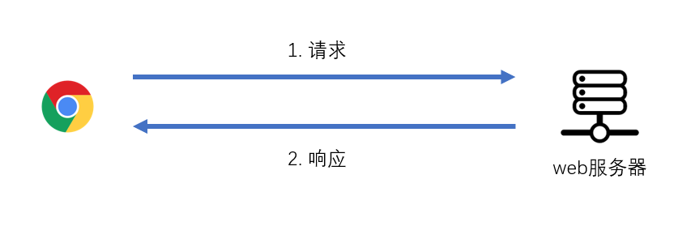

# http协议 {ignore}
> url地址全称为Uniform Resource Locator，统一资源定位符，是一个字符串，它的格式如下：
```https://www.baidu.com/s?wd=王思聪```

会被编码为

```https://www.baidu.com/s?wd=%E7%8E%8B%E6%80%9D%E8%81%AA```

> url地址不能过长，因为很多浏览器对url地址长度是有限制的，chrome对url的长度限制为8182个ASCII字符
## http协议

我们可以通过url地址访问服务器，但是，浏览器和服务器之间的数据到底是怎么交互的，数据的格式是什么，这取决于使用什么协议

最常见的协议，就是http协议
- http弊端：无法保证传输数据的秘密性，无法保证信息的完整性和准确性，因为传输的过程数据可能被篡改，替换，服务端无法判断数据是否被篡改，无法保证消息来源的可靠性，服务端无法判断数据就是来自于客户端。
http协议将和服务器的一次交互看作是两段简单的过程组成：**请求 request**和**响应 response**

- 请求：客户端通过url地址发送数据到服务器的过程
- 响应：服务器收到请求数据后回馈数据给客户端的过程



当 请求-响应 完成后，本次交互结束，如果需要得到额外的服务，则需要重新发送新的请求

同时，http协议约定了请求的消息格式和响应的消息格式
### 请求消息格式

请求消息格式有两部分组成：**请求头 request headers** 和 **请求体 request body**

#### 请求头

请求头是一个多行文本的字符串

比如我们请求 http://www.baidu.com/s?wd=html, 得到的请求头可能如下：

```
GET /s?wd=html HTTP/1.1
Host: www.baidu.com
User-Agent: Mozilla/5.0 (Windows NT 10.0; Win64; x64) AppleWebKit/537.36 (KHTML, like Gecko) Chrome/79.0.3945.88 Safari/537.36
...
```

可以看出，该字符串有两个部分组成

1. 请求行：请求方法 path 协议
   1. 请求方法：一个普通的字符串，会被服务器读取到。常见的请求方法：**GET**、**POST**
   2. path：即url中的 path + search + hash，服务器可能会用到path中的信息
   3. 协议：协议以及版本号，目前固定为 HTTP/1.1
2. 键值对：大量的属性名和属性值组合，可以自定义。
   1. Host：url地址中的hostname
   2. User-Agent：客户端信息描述
   3. 其他键值对

请求头描述了请求的**元数据**信息，这里的元数据信息是指与业务无关的额外信息
3. 请求头：
   1. cookie：
   2. connection: keep-alive:http1中用来表示长连接的,建立一次链接后不会断开，可以一直发送数据。
当我们在浏览器地址栏输入一个url按下回车后，浏览器会自动构建一个请求头，请求方法为GET，然后向服务器发送请求
   3. Cache-Control：对缓存进行控制,如一个请求希望响应的内容在客户端缓存一年,或不被缓可以通过这个报文头设置
#### 请求体

包含业务数据的字符串

理论上，请求体可以是任意格式的字符串，但习惯上，服务器普遍能识别以下格式：

- application/x-www-form-urlencoded：```属性名=属性值&属性名=属性值...```
- application/json：```{"属性名":"属性值", "属性名":"属性值"}```
- multipart/form-data：使用某个随机字符串作为属性之间的分隔符，通常用于文件上传

由于请求体格式的多样性，服务器在分析请求体时可能无法知晓具体的格式，从而不知道如何解析请求体，因此，服务器往往要求在请求头中附带一个属性```Content-Type```来描述请求体使用的格式

例如

```
Content-Type: application/x-www-form-urlencoded
Content-Type: application/json
Content-Type: multipart/form-data
```

#### GET 和 POST

虽然http协议并没有规定请求方法必须是什么，但随意的请求方法服务器可能无法识别

服务器一般都能识别GET和POST请求，并做出以下的差异化处理

1. 如果是GET请求，不读取请求体，业务数据从path的search或hash中读取
2. 如果是POST请求，读取请求体，业务数据从请求体中获取，关于请求体的格式，不同的服务器、同一个服务器的不同服务要求不同

> 在浏览器地址栏中输入url地址是不能产生POST请求的，可以使用表单提交产生POST请求

由于服务器对GET和POST处理的差异，造成了GET和POST请求的差异：

1. GET请求一般没有请求体，POST请求有
2. GET请求的业务数据放在地址中，安全性较差（误分享、被偷窥）
3. GET请求传递的业务数据量是有限的，POST是无限的（除非服务器限制）
4. GET请求利于分享页面结果，POST不行
5. 在浏览器中刷新或回退页面时，会按照该页面之前的请求方式重新发送请求，如果是GET请求，浏览器会重新发送GET请求；如果是POST请求，浏览器会重新构建之前的消息体数据，通常会弹出提示

### 响应消息格式

和请求类似，响应消息也分为**响应头**(response headers)和响应体(response body)

#### 响应头

比如我们请求 http://www.baidu.com/s?wd=html, 得到的响应头可能如下：

```
HTTP/1.1 200 OK
Content-Type: text/html;charset=utf-8
Server: BWS/1.1
...
```

可以看出，该字符串有两个部分组成

1. 响应行：协议 状态码 状态文本
   1. 协议：协议以及版本号，目前固定为 HTTP/1.1
   2. 状态码和状态文本：一个数字和数字对应的单词，来描述服务器的响应状态，浏览器会根据该状态码做不同的处理。
      1. 200 OK：一切正常。你好，```我好，大家好。```
      2. 301 Moved Permanently：资源已被永久重定向。```你的请求我收到了，但是呢，你要的东西不在这个地址了，我已经永远的把它移动到了一个新的地址，麻烦你取请求新的地址，地址我放到了请求头的Location中了```
      3. 302 Found：资源已被临时重定向。```你的请求我收到了，但是呢，你要的东西不在这个地址了，我临时的把它移动到了一个新的地址，麻烦你取请求新的地址，地址我放到了请求头的Location中了```
      4. 304 Not Modified：文档内容未被修改。```你的请求我收到了，你要的东西跟之前是一样的，没有任何的变化，所以我就不给你结果了，你自己就用以前的吧。啥？你没有缓存以前的内容，关我啥事```
      5. 400 Bad Request：语义有误，当前请求无法被服务器理解。```你给我发的是个啥啊，我听都听不懂```
      6. 403 Forbidden：服务器拒绝执行。```你的请求我已收到，但是我就是不给你东西```
      7. 404 Not Found：资源不存在。```你的请求我收到了，但我没有你要的东西```
      8. 500 Internal Server Error：服务器内部错误。```你的请求我已收到，但这道题我不会，解不出来，先睡了```
      9. 通常认为，0~399之间的状态码都是正常的，其他是不正常的
2. 键值对：大量的属性名和属性值组合，可以在服务器响应的时候自定义。
   1. Content-Type：响应体中的数据格式，常见格式如下
      1. text/plain: 普通的纯文本，浏览器通常会将响应体原封不动的显示到页面上
      2. text/html：html文档，浏览器通常会将响应体作为页面进行渲染
      3. text/javascript：js代码，浏览器通常会使用JS执行引擎将它解析执行
      4. text/css：css代码，浏览器会将它视为样式
      5. image/jpeg：浏览器会将它视为jpg图片
      6. attachment：附件，浏览器看到这个类型，通常会触发下载功能
      7. 其他MIME类型
   2. Server：web服务器类型

#### 响应体

响应消息的正文

## 在浏览器地址栏中输入一个页面地址，按下回车键后发生了什么？

1. 浏览器将url地址补充完整：没有书写协议，添加上协议
2. 浏览器对url地址进行url编码：如果url地址中出现非ASCII字符，则浏览器会对其进行编码
3. 浏览器构造一个没有消息体的GET请求，发送至服务器，等待服务器的响应，此时浏览器标签页往往会出现一个等待的图标
4. 服务器接收到请求，将一个HTML页面代码组装到消息体中，响应给浏览器
5. 浏览器拿到服务器的响应后，丢弃掉当前页面，开始渲染消息体的html代码。浏览器之所以直到这是一个html代码，是因为服务器的响应头指定了消息类型为text/html
6. 浏览器在渲染页面的过程中，发现有其他的嵌入资源，如CSS、JS、图片等
7. 浏览器使用不阻塞渲染的方式，重新向服务器发送对该资源的请求，拿到响应结果后根据Content-Type做相应处理
8. 当所有的资源都已下载并处理后，浏览器触发window.onload事件
##### 浏览器底层原理考虑
1. UI线程判断用户输入的是url还是query
2. 开始导航，ui线程通知网络线程进行网络请求，这是出现加载图标。，网络线程会执行DNS查询，随后建立连接，如果网络线程收到请求头为301，那么网路进程会通知ui线程服务器重定向之后，另一个url请求出发。
3. 请求反应后，网络进程根据content-type判断响应格式，如果是HTML。下一步把这些数据交给渲染进程，如果是zip文件，会把相关数据给下载管理器处理，此时出发Google safeBrowing，浏览器安全处理，如果匹配到恶意的站点，网络线程会出现一个警告页面。
4. 确认导航，一旦 
## 浏览器底层原理
- chorme浏览器，多进程架构，
  1. 浏览器进程：tab标签切换，前进后退等操作，网络请求，访问文件等底层操作
  2. 渲染进程：负责一个tab页面呈现的事情
  3. 插件进程：负责插件的加载
  4. Gpu进程相关操作

#### 优点：
1. 某一渲染进程出问题不会影响其他的进程
2. 更安全，在系统层面限定了不同进程的权限

#### 缺点：
1. 不同进程间的内存不共享
2. 谷歌浏览会根据内存cpu限制最大进程数量，当达到一定的限度时，新打开的Tab会共用之前一个站点的渲染进程。

## ajax

不仅仅是浏览器可以发出请求并获得响应，任何具有网络通信能力的程序均可以这样做。

过去，在浏览器中，只有浏览器本身有发送请求的能力，直到ajax的出现。

ajax是一种技术，让JS语言在浏览器环境中获得了新的API，通过该API，JS代码拥有了和服务器通信的能力

传统的ajax代码如下

```js
var xhr = new XMLHttpRequest(); //创建发送请求的对象
xhr.onreadystatechange = function(){ //当请求状态发生改变时运行的函数
    // xhr.readyState： 一个数字，用于判断请求到了哪个阶段
    // 0: 刚刚创建好了请求对象，但还未配置请求（未调用open方法）
    // 1: open方法已被调用
    // 2: send方法已被调用
    // 3: 正在接收服务器的响应消息体
    // 4: 服务器响应的所有内容均已接收完毕
        
    // xhr.responseText： 获取服务器响应的消息体文本

    // xhr.getResponseHeader("Content-Type") 获取响应头Content-Type
}
xhr.setRequestHeader("Content-Type", "application/json"); //设置请求头
xhr.open("请求方法", "url地址"); //配置请求
xhr.send("请求体内容"); //构建请求体，发送到服务器
```

> 使用ajax访问：http://yuanjin.tech:5100/api/local

### 三次握手
- 三次握手主要是为了确认两台主机都具备收和发的能力
 1. 第一次：请求建立连接 建立连接用SYN=1表示，序列号用seq=n表示，n为一个数 249，**第一次握手让让主机B知道了主机A可以发送消息**
 2. 第二次：同意建立连接SYN=1，二是确认收到了刚才的信息ack seq+1，三是发送自己的序列号seq = x；**第二次握手让主机A知道了主机B可以接收到消息，和发送消息**
 3. 第三次：一是表示开始发送SYN=0，二是成功收到了B的消息 ack=刚才的seq+1，三是发送自己的序列号seq=最开始的序列号+1 **第三次握手让B知道了A可以接收到消息**

### 四次挥手
- 有AB主机传输数据，
   1. 当主机A向主机B发送数据时，数据传输完了，但是并不可以断开连接，因为B不知道A数据传输完了，所以A告诉B传输完了。**第一次挥手A告诉B数据发完了**
   2. B还没有接收完数据，虽然A把数据传完了，所以只能先回复A，知道A，知道你发完了 **第二次挥手：B知道A发完了**
   3. B知道A发完了数据，但是A不知道B是否接收完了，**第三次挥手B告诉A数据接收完了**
   4. 这是A知道B，接收完数据了，就可以放心的断开连接了，**第四次挥手：A知道B接收完了**

   为什么不是三次挥手
   因为虽然当A告诉b发完了的时候，b还有可能没接收完消息，只能先回复一部分，告诉A知道A已经发完了，当消息全部接收完毕的时候，才会告诉A已经收完了。

   ### https
- ssl层传输
> 六个阶段
   1. 客户端申请建立https通信
   2. 服务端响应并向客户端传递证书
   3. 客户端验证证书，获取公钥，加密后传递给服务端
   4. 服务端接收消息，用私钥解密，告诉客户算ssl层建立完成，https建立完成
   5. 共享密钥交换完成，https建立完成后，客户端和服务器端利于共享密钥加密通信
   6. 客户端断开连接
- 对称加密，使用同一个共有秘钥进行加密，泄露风险较高。
- 非对称加密，使用公有密钥加密，服务器端用低腰进行解密。

## http发展史
- http0.9，
   1. 服务器端只能响应html格式的字符串，只有get请求
   2. http1.0, 不仅可以传输文字，还可以传输图像，视频，二进制的文件，除了get请求 还有post head命令（请求不会返回响应体，仅仅时http响应头信息，用于判断某个信息是否存在）
   3. 缺点：tcp连接一次只能发送一次请求，发送数据完毕，连接就关闭，三次握手耗费时间
- http1.1 
   1. 支持了长连接：connection：keep-alive：一个tcp可以传输多个请求
   2. 增加了缓存处理，用 expires强缓存，if-Modified-since(协商缓存)标识
   3. 增加了错误的通知管理： 新增了24个错误状态响应码，409 请求资源与当前状态冲突，410 服务器资源被永久删除
   4. 缺点：
     1. 虽然tcp连接可以发送多个请求，但是所有的数据通信都是依次进行的，如果前面的传输较慢，那么后面的就会一直等待，造成对头堵塞，
     2. 传输数据都是明文，服务器和客户端无法验证对方身份，也就无法保证数据的安全性。
     3. header头过大，传输成本高，在移动端耗费流量。
     4. keep-alive 传输图片的时候可能浪费性能，可能文件传输后，保持一段不必要的连接时间
- SPDY协议
   1. 主要解决http1.1传输效率不高的问题，这个协议在谷歌浏览器证明可行以后，就被单做http2.0的基础综合了https和http协议
   2. 降低延迟：多路复用，采用stream共享一个tcp连接，解决了对头堵塞。减低延迟的同时提高了宽带的利用率。
   3. 请求优先级，允许给每一个request设置优先级，这样重要的请求可能会被优先传输。
   4. 压缩header头。
   5. 基于https协议传输，安全了
- http2.0
   1. SPDY的升级版，支持了http传输，SYDP必须使用https
   2. 多路复用
   3. 请求优先级
   4. header合并压缩
   5. 服务器端预先推送
## JSONP原理
   1. 判断当前源是否跨域，如果同源正常发送，
   2. 不同源 生成一个script标签
   3. 再生成一个随机的callback名字，还得创建一个名字为这个的方法(因为必须是一个可以执行的js代码)。后端会返回一个cakkback()执行，里暖白的
   4. 将callback作为参数拼接在后方。
   5. 设置script标签的src，设置为要请求的接口。为啥是src
   以上是前端部分
   5. 后端接收到数据后，将返回的数据callback的值和括号包裹起来、例如callback=asd123，后端拼接asd123({a:1,b:2,c:3});
   6. 内容返回。
   7. js代码执行名字为asd123的函数
```js
  var MyJSONP = {
     ajax: function(options) {
        var 
     }
  }

```
## 安全
### CSRF 特点和原理（跨站请求伪造）
> 恶意网站把正常用户当作媒介，通过模拟正常用户的操作攻击其**登录过的**网站。
- 原理

1. 用户访问正常的站点，登陆后，获取了正常站点的令牌，以cookie的形式保存。
2. 当用户访问了恶意的站点，恶意站点通过某种形式去请求正常的站点（请求网站），迫使用户把正常的令牌传递到正常的站点，完成攻击。
- 防御
- cookie的SameSite
> 现在很多浏览器都支持SameSite属性，支持禁止跨域请求携带cookie，只需要把cookie的snameSite设置为Strict。
```SameSite```有以下取值：
- Strict:严格，所有的跨站请求都不附带cookie，有的时候用户体验性不好。
- Lax:宽松，所有跨站的超链接，get请求报表的那，预加载链接会发送cookie，其他情况不发送。
- None：无限制
  这种方法非常简单，及其有效，但是前提条件是:用户不能使用太旧的浏览器。
#### 验证referer和Origin
> 页面中的二次请求都会附带referer和Origin请求头，向服务器表示该请求来自哪个页面，服务器可以通过这个头来进行验证。但是某些浏览器的referer是可以被用户禁止的，（这种情况极少）。
#### 使用非cookie令牌
> 这种做法是要求每次请求在请求头或请求体中附带token，请求的时候authorizatin：token。
#### 验证码
> 要求每个要防止CSRF的请求都必须附带验证码
#### 二次验证：做出敏感操作，进行二次验证。
#### 随机表单数
### xss攻击（注入攻击）跨站脚本攻击(css攻击)
1. 恶意用户提交了恶意的内容到服务器。
2. 服务器没有识别，保存了恶意的内容到数据库
   1. 当正常的用户访问服务器，
   2. 服务器在不知情的情况下，给予了恶意的内容，让正常的用户遭到攻击。
```js
<script>
发送ajax请求，获取cookie
</script>

```
#### 防御
- 防止恶意内容保存到数据库，
 三方库（xss）识别恶意内容进行编码。将<s>进行编码。进行安全过滤。，如onclick等href alert等过滤。 

### 反射型
> 恶意用户分享了一个正常的网站链接，链接中有恶意的内容。（把a元素补全）  （把javascirpt过滤掉，使用/绝对路径）
> 该用户的点击了该链接
> 服务器在不知情的情况下，把链接的恶意内容读取了出来，放到页面中，让正常用户遭到攻击。
```js
把a元素补全）  （把javascirpt过滤掉，使用/绝对路径）
```

### DOM型
1. 恶意用户通过任何方式，向服务器中注入了一些dom元素，从而影响了服务器的dom结构。
2. 普通用户访问的时候，运行的是服务器的正常js代码
   编码后在渲染
## 进程和线程
- 一个应用程序，总是通过操作系统启动的，当操作系统启动一个应用程序时，会给其分配一个进程

> 一个进程拥有独立的、可伸缩的内存空间，原则上不受其他进程干扰
> 进程之间是可以通信的，只要两个进程双方遵守一定的协议，比如ipc

**CPU在不同的进程之间切换执行**

虽然一个应用程序在启动时只有一个进程，但它在运行的过程中，可以开启新的进程，进程之间仍然保持相对独立

如果一个进程是直接由操作系统开启，则它叫做主进程

如果一个进程B是由进程A开启，则A是B的父进程，B是A的子进程，子进程会继承父进程的一些信息，但仍然保持相对独立
```js
// nodejs 中开启子进程
const childProcess = require("child_process"); // 导入内置模块

childProcess.exec(在子进程运行的命令, (err, out, stdErr) => {
  // 回调函数中可以获取子进程的标准输出，这种数据交互是通过IPC完成的，nodejs已经帮你完成了处理
  // err：开启进程过程中发生的错误
  // out: 子进程输出的正常内容
  // stdErr: 子进程输出的错误内容
  // 子进程发生任何的错误，绝不会影响到父进程，它们的内存空间是完全隔离的
});

// 过去，nodejs没有提供给用户创建线程的接口，只能使用进程的方式
// 过去，nodejs还提供了cluster模块，通过另一种模式来创建进程
// 现在，nodejs已经提供了线程模块，对进程的操作已经很少使用了
```
#### 线程
操作系统启动一个进程（无论是主进程，还是子进程），都会自动为它分配一个线程，称之为主线程

程序一定在线程上运行！！

主线程在运行的过程中，可以创建多个线程，这些线程称之为子线程

当操作系统命令CPU去执行一个进程时，实际上，是在该进程的多个线程中切换执行

线程和进程很相似，它们都是独立运行，最大的区别在于：线程的内存空间没有隔离，共享进程的内存空间，线程之间的数据不用遵守任何协议，可以随意使用

什么时候要使用线程？

使用线程的主要目的，是为了充分使用多核cpu。线程执行过程中，尽量的不要阻塞。

最理想的线程效果：

线程数等于cpu的核数
线程永不阻塞
没有io
只存在大量运算
线程相对独立，几乎不使用共享数据
线程一般处理cpu密集型操作（运算操作），而io密集型操作不适合使用线程，而适合使用异步

为了避免线程执行过程中共享数据产生的麻烦，nodejs使用独特的线程机制来尽力规避：

// 创建子线程的父线程
const { Worker } = require("worker_threads");
const worker = new Worker(线程执行的入口文件, {
  workerData: 开启线程时向其传递的数据,
}); // worker是子线程实例

// 通过EventEmitter监听子线程的事件
worker.on("exit", () => {
  // 当子线程退出时运行的事件
});
worker.on("message", (msg) => {
  // 收到子线程发送的消息时运行的事件
});
worker.postMessage(任意消息); // 父线程向子线程发送任意消息
worker.terminate(); // 退出子线程
const {
  isMainThread, // 是否是主线程
  parentPort, // 用于与父线程通信的端口
  workerData, // 获取线程启动时传递的数据
  threadId, // 获取线程的唯一编号
} = require("worker_threads");

parentPort.on("message", (msg) => {
  // 当收到父线程发送的消息时，触发的事件
});
parentPort.postMessage(workerData); // 向父线程发送消息